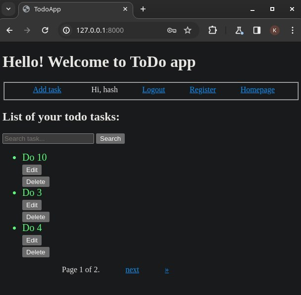

<h1>Usage :</h1>

```bash
python manage.py makemigrations 
python manage.py migrate 
python manage.py runserver
```
<br>

<b>You can add, edit your tasks, but firstly you have to register your account:</b>
<br>



<h2>Usage to deploy docker container:</h2>

```bash
docker compose up
```